# RecoverOps Lab

[](https://github.com/RedBeret/recoverops-lab/actions/workflows/ci.yml)
[](https://github.com/RedBeret/recoverops-lab/actions/workflows/rehearsal.yml)
[](LICENSE)
[](requirements-dev.txt)

RecoverOps Lab proves that a PostgreSQL backup can be restored. It creates a known
dataset, captures its logical fingerprint, encrypts a database dump with restic,
removes the source database after explicit approval, restores into an isolated target,
and produces machine-readable and human-readable recovery evidence.

Everything runs locally in WSL with Docker. No cloud account, paid automation platform,
or production credentials are required.

## What it demonstrates

- deterministic test data and repeatable database fingerprints
- Ansible-driven backup, disaster, restore, and verification workflows
- PostgreSQL custom-format dumps with SHA-256 manifests
- encrypted restic snapshots and full repository integrity checks
- an explicit approval gate before destructive testing
- exact Docker Compose project and service boundary validation
- restore into a separate recovery database, never over the source
- schema, row-count, canonical data, version, and HTTP health comparisons
- measured RTO, restore duration, and backup age at recovery
- JSON and Markdown evidence suitable for CI artifacts and review
- rejection of modified dump content before `pg_restore` runs

## Architecture

```mermaid
flowchart LR
    OP["WSL operator"] --> CLI["recoverctl"]
    CLI --> ANS["Ansible workflows"]
    ANS --> PDB["Primary PostgreSQL"]
    PDB --> DUMP["Dump + fingerprint + SHA-256 manifest"]
    DUMP --> RESTIC["Encrypted restic repository"]
    RESTIC --> RDB["Isolated recovery PostgreSQL"]
    RDB --> CHECK["Data + schema + API verification"]
    CHECK --> REPORT["JSON + Markdown evidence"]
```



The source and recovery APIs make the state transition visible. The source reports
healthy before disaster injection and degraded afterward. The recovery API is degraded
until a verified restore succeeds.

## Requirements

- WSL2 with an Ubuntu distribution
- Python 3.11 or newer
- Docker with a reachable daemon
- Docker Compose v1 or v2
- Git
- approximately 1 GB of free disk space for images and generated lab data

Compose v2 is preferred. The scripts also support the `docker-compose` v1 command used
by older WSL development environments.

## Quick start

Run from the repository root inside WSL:

```bash
./scripts/bootstrap.sh
./scripts/lab.sh doctor
./scripts/lab.sh rehearse --apply
./scripts/lab.sh report
./scripts/lab.sh down
```

`bootstrap.sh` creates a project-local virtual environment, a generated PostgreSQL
password, an encrypted-repository password, and ignored artifact directories. Running
it again preserves existing credentials.

`rehearse` is destructive only inside the disposable lab, so it requires the literal
`--apply` flag. Without that flag it exits with code 2 before invoking Ansible.

## Step-by-step workflow

The complete rehearsal can also be run one stage at a time:

```bash
./scripts/lab.sh up
./scripts/lab.sh seed
./scripts/lab.sh backup
./scripts/lab.sh disaster --apply
./scripts/lab.sh restore
./scripts/lab.sh verify
./scripts/lab.sh report
```

Useful non-destructive commands:

```bash
./scripts/lab.sh doctor
./scripts/lab.sh status
./scripts/lab.sh test
./scripts/lab.sh fingerprint --target recovery
```

## Lab endpoints

| Service | Local address | Expected state |
| --- | --- | --- |
| Primary PostgreSQL | `127.0.0.1:55432` | Source database before disaster |
| Recovery PostgreSQL | `127.0.0.1:55433` | Isolated restore target |
| Primary API | <http://127.0.0.1:18080/health> | `200` before disaster, `503` after |
| Recovery API | <http://127.0.0.1:18081/health> | `503` before restore, `200` after |

All published ports bind to loopback. They are not exposed on the WSL network interface.

## Recovery evidence

Generated output stays under the ignored `artifacts/` tree:

```text
artifacts/
  backup/       # dump, source fingerprint, manifest, restic results
  reports/      # recovery-report.json and recovery-report.md
  restic-repo/  # encrypted repository
  restore/      # temporary restored snapshot content
  state/        # workflow timestamps
```

The report passes only when:

- source and recovery schema hashes match
- canonical data hashes match
- all table row counts match
- PostgreSQL versions match
- the primary API reports `503` after the disaster
- the recovery API reports `200`

RTO is measured from the start of disaster injection to successful restore completion.
"Backup age at recovery" measures how old the captured source fingerprint is when the
restore completes; it is evidence from this rehearsal, not a claimed production RPO.

## Safety model

- `disaster` and `rehearse` require `--apply`.
- The destructive target must have Compose project label `recoverops` and service label
  `primary-db`.
- Restore requires the distinct `recovery-db` service label.
- The disaster removes only the `recoverops` database inside the primary lab container.
- The backup manifest is verified before destruction and again before recovery changes.
- Recursive cleanup is limited to `artifacts/restore/current` beneath the repository.
- `.env`, `.secrets/`, dumps, repository data, and reports are ignored by Git.

These boundaries are enforced in code and covered by tests, including rejection of a
container labeled as belonging to another Compose project.

## Testing

```bash
./scripts/lab.sh test
```

The local suite runs pytest, Ruff formatting and lint checks, shell syntax checks,
Compose rendering, syntax checks for every playbook, and Ansible's production lint
profile.

The fast GitHub Actions workflow runs on pushes and pull requests. A separate scheduled
and manually dispatchable workflow runs the live destructive rehearsal and uploads the
recovery evidence.

## Project structure

```text
ansible/          playbooks and focused workflow roles
app/              primary/recovery health API image
docs/             architecture, plan, and operator notes
lab/              deterministic PostgreSQL schema and data
scripts/          native WSL bootstrap and launcher
src/recoverops/   CLI, safety, backup, restore, and evidence code
tests/            unit and project-contract tests
```

## Production boundary

This is a recovery rehearsal lab, not a production backup product. PostgreSQL documents
several backup strategies, including SQL dumps, filesystem backups, and continuous
archiving. The right production design depends on database size and required recovery
objectives. See the [PostgreSQL backup and restore documentation](https://www.postgresql.org/docs/current/backup.html).

Production use also needs off-host copies, retention and pruning policy, immutable
storage, managed secrets, access controls, capacity testing, alerting, and regular
operator exercises. Restic's repository model and restore behavior are documented in
the [restic documentation](https://restic.readthedocs.io/en/stable/).

## Contributing and security

See [CONTRIBUTING.md](CONTRIBUTING.md) for the development workflow and [SECURITY.md](SECURITY.md)
for reporting security problems. Design decisions and completed checks are recorded in
[WORKLOG.md](WORKLOG.md).

## License

MIT. See [LICENSE](LICENSE).
